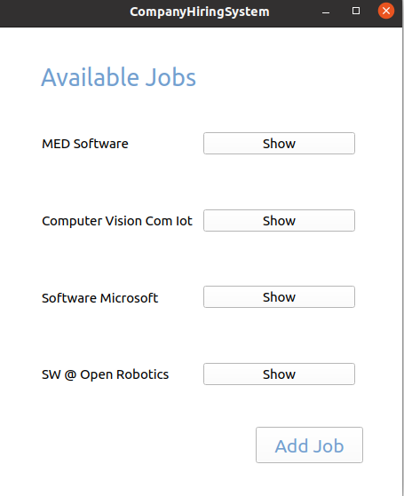
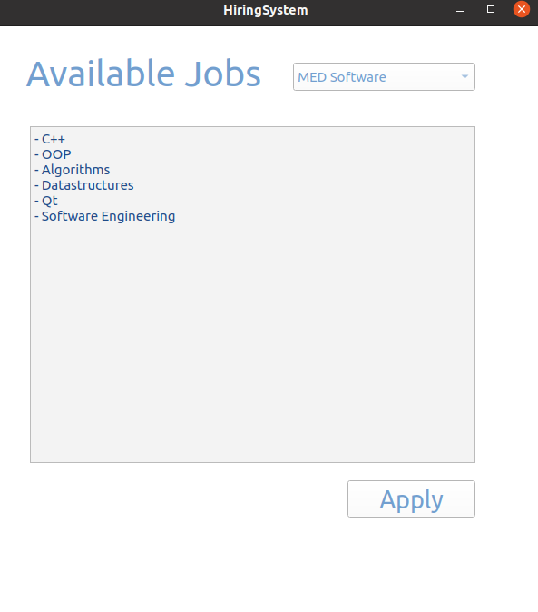
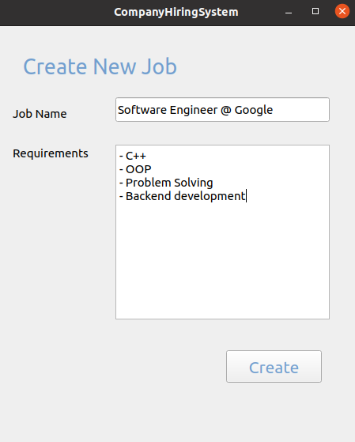
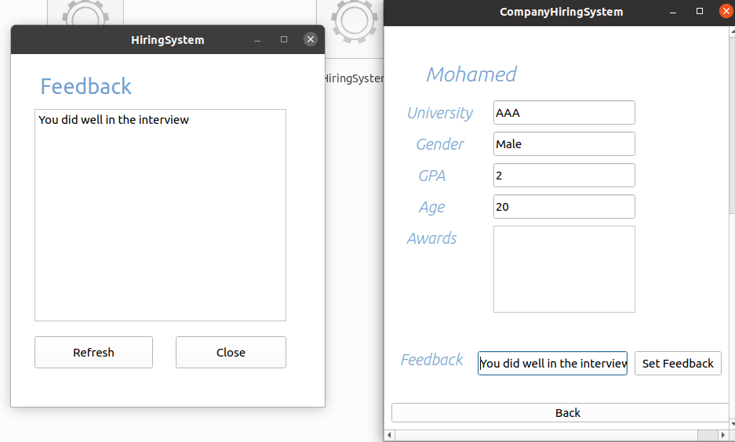
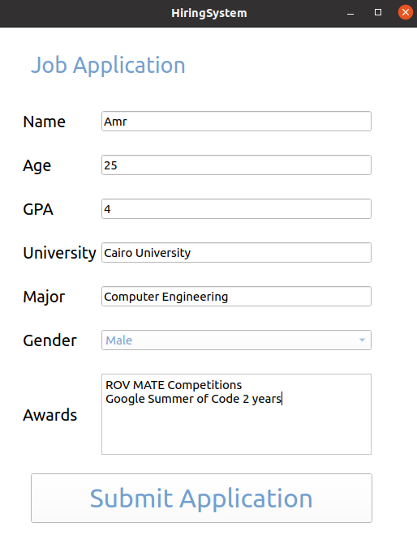
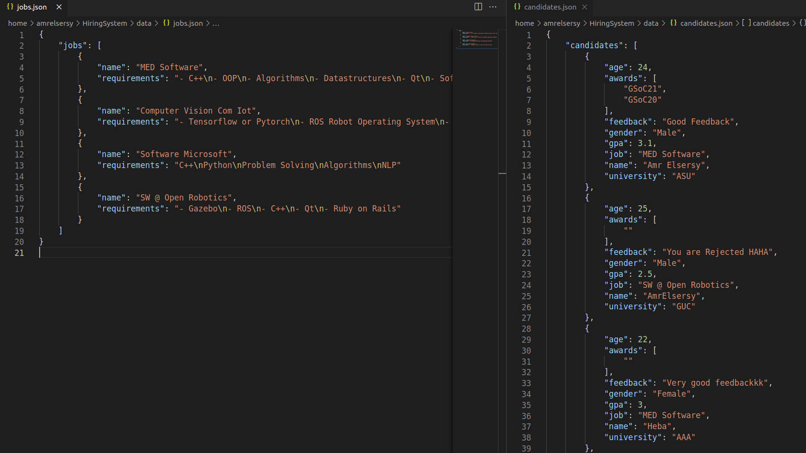
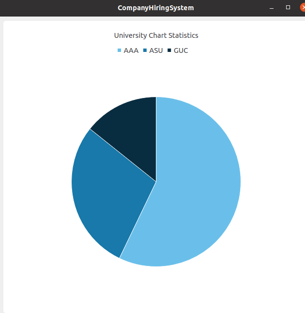
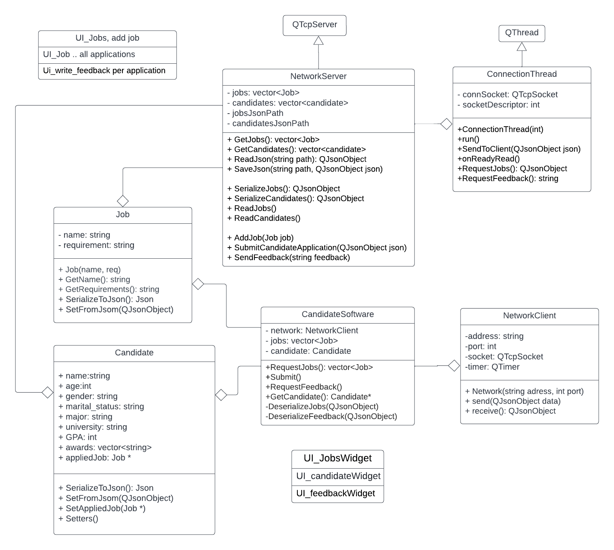

# Hiring Managment System

A user interface tool to manage hiring process for jobs for both applicants and companies using C++ & Qt

## Preview
### Company Side:
a GUI that shows all the jobs in the database of the company

### Candidates Side:
a GUI that user can select a job to see its requirements then apply for it


## Features:
- Company can add new jobs and their requirements and they will be saved in json format and restored with every system lanuch

- Company can show all the applicants for each job, and submit a feedback to the applicant

- Candidates can apply for jobs and fill their application

- Data includes jobs and applications are saved in json format and get loaded at the begining of the lanuch

- Company can show statisics based on Universities of applicants



## UML Design
Class Diagram for the C++ backend


## How to run it
All executables are in folder `executables/`, you have to just execute them

```python
# for company system
$ ./CompanyHiringSystem

# for candidate system
$ ./HiringSystem
```

It supports multiple clients at the same time, so you can run `./HiringSystem` many times in different terminals